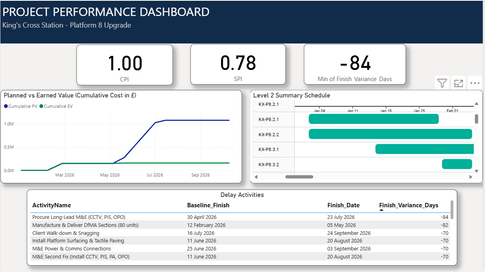

# King's Cross Station - Platform 8 Upgrade (Project Controls Portfolio)

### 📊 Project Overview
This project simulates a full-lifecycle **Project Controls** environment for a complex rail infrastructure upgrade. It demonstrates the integration of **Primavera P6** for scheduling, **Python** for automated data transformation, and **Power BI** for advanced performance analytics.

* **Project Value:** £1.70 Million (NEC3 Option A)
* **Scope:** Demolition, Piling, DfMA Platform Installation, and M&E Systems.
* **Constraint:** Critical possession windows (railway closures).

---

### 📈 Performance Dashboard
*(Below is the interactive dashboard built to visualize project health, identifying a critical -84 day delay due to site obstructions.)*

---

### 🛠️ Technical Workflow

#### 1. Planning & Scheduling (Primavera P6)
* Developed a **Level 3, logic-linked schedule** with 30+ activities.
* Applied **Cost Loading** (£1.73m budget) to enable Earned Value Management (EVM).
* Created a **WBS Structure** aligned with construction phases (Design -> Procurement -> Construction).
* **Scenario:** Simulated a major "Site Obstruction" event during piling, updating the remaining duration to reflect a realistic delay.

#### 2. Data Automation (Python)
* Extracted raw `.xlsx` activity data from Primavera P6.
* Wrote a **Python script (Pandas)** to automate data cleaning:
    * Mapped P6 internal column names to user-friendly headers.
    * Calculated **SPI** (Schedule Performance Index) and **CPI** (Cost Performance Index).
    * Computed **Variance** between Current Finish and Baseline Finish.
* *See `clean_p6_data.py` in the file list for the code.*

#### 3. Performance Analytics (Power BI)
* **Data Modeling:** Created a dedicated `DateTable` and established relationships for time-intelligence functions.
* **DAX Measures:** Wrote custom DAX for **Cumulative Planned Value (PV)** and **Cumulative Earned Value (EV)** to generate the S-Curve.
* **Forensic Analysis:** Built a dynamic delay table to isolate activities with >10 days variance, pinpointing the "Piling Zone 1" obstruction as the root cause.

---

### 🏆 Key Competencies Demonstrated
* **Project Planning:** P6 Logic, Resourcing, Baselines.
* **Data Engineering:** ETL (Extract, Transform, Load) using Python.
* **Project Controls:** Earned Value Management (EVM), S-Curves, Variance Analysis.
* **Reporting:** Executive-level dashboard design.
